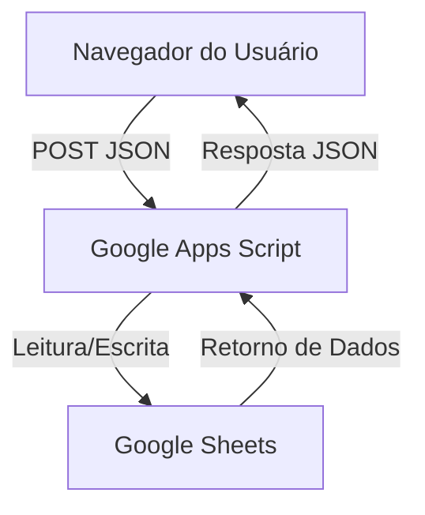

# Documentação Técnica - Sistema de Checklist SAMU 192

## 1. Visão Geral
Este sistema foi desenvolvido para facilitar o processo de checklist das viaturas do SAMU 192. Ele funciona como uma aplicação web estática (SPA) que se comunica com um backend no Google Apps Script.

## 2. Fluxo de Dados

### Endpoints Principais (via `acao` no payload):
- `getDadosIniciais`: Carrega nomes de servidores e viaturas.
- `realizarLogin`: Valida credenciais e retorna status de autenticação.
- `carregarItens`: Busca o banco de materiais filtrado por VTR e Turno.
- `salvarChecklist`: Registra as conferências realizadas.
- `obterEstatisticas`: Consolida dados para o dashboard.

## 3. Estrutura de Arquivos
- `login.html`: Gerencia o acesso ao sistema, ativação de cadastro e recuperação de senha.
- `usa.html`: Interface principal do checklist, contendo a lógica de cálculos e integração com o dashboard.
- `img/`: Pasta contendo recursos visuais (logotipos).

## 4. Lógica de Negócio
- **Precedência de Turno**: O sistema impede o login se o turno anterior não tiver sido finalizado, a menos que o usuário utilize a função de "Bypass" (com aviso de responsabilidade).
- **Responsabilidade Profissional**: Itens são bloqueados para edição dependendo se o usuário logado é Médico ou Enfermeiro.
- **Cálculo de Saldo**: `Saldo Final = (Início ou Inconstância) - Gasto + Reposição - Retirada`.

## 5. Manutenção
Para atualizar a URL do backend, localize a constante `SCRIPT_URL` no início da tag `<script>` em ambos os arquivos HTML.

---
*Documentação gerada em 09/02/2026*
